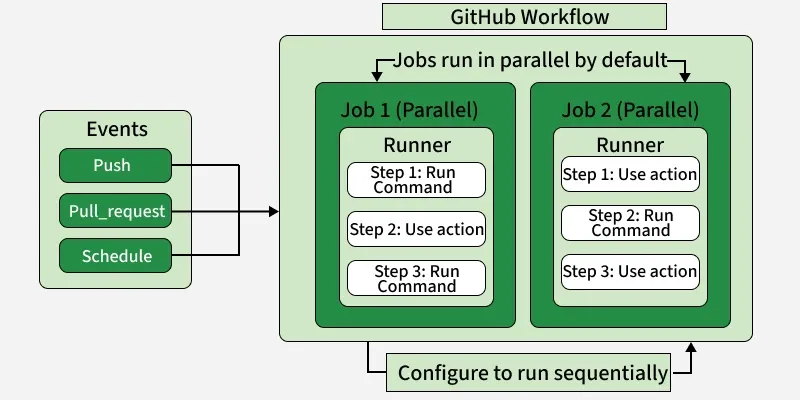

# GitHub Actions

- GitHub Actions is a CICD platform built directly into GitHub
- It allows you to automate your build, test and deployment pipeline.

## Components

- Workflows
- Events
- Runners
- Jobs
- Steps
- Actions
- Inputs & Outputs
- Environment Variables and Secrets

> A workflow runs in response to specified events. It consists of one or more jobs, each containing ordered steps that execute on a runner.



### Workflows

- It is an overall automation process.
- It contains jobs, triggers, and steps.
- Defined in `.github/workflows` directory in the repository.

```yaml
name: CI Pipeline
on: push
```

### Events (Triggers)

- It tell GitHub when to run the workflow.
- Code events: push, pull_request, pull_request_target
- Issue/PR events: issues, pull_request_review
- Scheduled: schedule (cron syntax)
- Manual: workflow_dispatch (button trigger)
- Webhooks: release, deployment, discussion
- External: repository_dispatch (API trigger)

```yaml
on:
  push:
    branches: [main]
```

### Runners

- Runner is the server/container that listens for available jobs, runs one job at a time.
- It reports the progress and results back to GitHub when the job is complete.
- It has two types:
  1. GitHub-hosted: Managed by GitHub, supports Linux, Windows, macOS. Cannot customize environment or software.
  2. Self-hosted: You manage the runner, can be on-premises or cloud, supports custom environments and software.

### Jobs

- Job is set of steps executed on runner.
- A workflow is made up of one or more jobs.

```yaml
jobs:
  build:
    runs-on: ubuntu-latest
```

### Steps

- Individual tasks within a job.
- Run sequentially.
- Steps run commands or actions.

```yaml
steps:
  - name: Checkout code
    uses: actions/checkout@v3
```

### Actions

- Reusable code used inside the steps.
- Can be: Community (from GitHub Marketplace, e.g., docker/build-push-action) or Custom (you write them).
- Built-in: actions/checkout, actions/setup-node, actions/cache

```yaml
uses: actions/setup-node@v3
```

### Inputs & Outputs

- Used for passing data around the workflow

### Environment Variables (env)

- Used to store and pass non-sensitive data.
- Easily accessible in workflows
- Good for: App configs, File paths, Flags (dev/prod)

```yaml
env:
  APP_ENV: production
  REGION: us-east-1
```

### Secrets

- Encrypted values stored securely in GitHub.
- Used for sensitive data.
- Examples: AWS keys, API tokens, Passwords

```yaml
steps:
  - run: echo $GITHUB_TOKEN
```

## Sample Workflow

```yaml
name: Node CI

on: push

jobs:
  build:
    runs-on: ubuntu-latest

    steps:
      - uses: actions/checkout@v3
      - uses: actions/setup-node@v3
      - with:
          node-version: "18"
      - run: npm install
      - run: npm test
```
